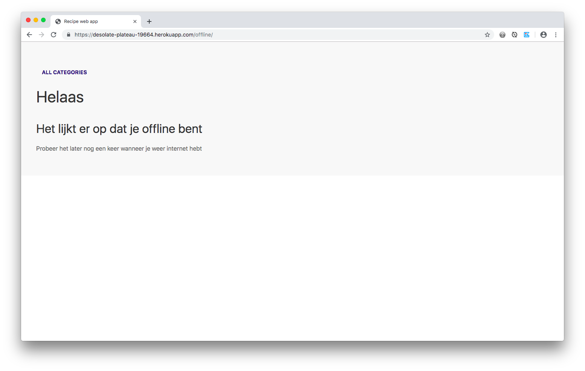

# Performance Matters @cmda-minor-web · 2018-2019


## Summary

***Build a progressive web app while getting acquainted with performance optimalisation techniques.***

## Table of contents

- [install](#install)
- [prototype](#prototype)
  - [ssr](#ssr)
  - [uikit](#uikit)
  - [api](#api)
- [performance](#performance)
  - [first view optimisation](#first-view-optimasition)
  - [gulp](#gulp)
  - [minify css](#minify-css)
  - [minify js](#minify-js)
- [compression](#compression)
- [intersection observer][#EXPERIMENT:-Intersection-Observer-Api]
- [Caching - Repeat view optimizations](#Caching - Repeat view optimizations)
- [revisioning](#revisioning)
- [service worker](#service-worker)
- [offline](#offline)
- [manifest](#manifest)

## Install

Clone this repo and follow these steps:

```
## Clone
HIER KOMT URL

## Install dependencies
npm install

## Start the dev server with Nodemon
npm run dev

## Start the server without Nodemon
npm run start
```

## Prototype

The web app I've build is a recipe search app. The first screen shows the user a couple of categories. Every category contains a list of recipes to choose from. On the recipe page is a simple explaination of how to cook the recipe and the ingredients required.

### SSR

To get started with building for optimalisation I wrote the webapp with Node(express js) and the Handlebars templating engine. In this way the client always gets html parses before having to wait to render the css and JS.

#### UIKIT

For the css and Js I've used a framework called [UIKit](https://getuikit.com/). The reason for this was that I wanted to really show some optimalisation. In a small code base, increase in performance shows minimal.

#### API

The recipes come from a public https api called [The meal db](https://www.themealdb.com/api.php). The api was very easy to use and the endpoints where pretty self-explanatory. One downside of using an external api; requesting data from the api badly influences our performance score. On a slow 3g connection a request to the api will also take extra time.

## Performance

### First view optimisation


The goal is to optimize the following:

- *first meaningful paint*
  - for the first view I've used compression and minification to reduce the sizes of the files that need to be downloaded. 
  - When the user has cached the assets such as images, the first meaningful pain is then again shorter. The imported images get loaded from the cache. 
  - optimising the critical render path. By reducing the size of the render blocking items. Later caching them
  - offline caching strategy
- *first contentful paint*
  - writing the app to server side rendering. I update only the content, not the whole page. 
  - Minimising and compressing the number of render blocking items. Although I had only one css file, compressing it reduced it download time. 
- *time to interactive*
  - compressing and minifying the Javascript of this app has a positive effect on the time to interactive. 

All of the audits are done on mobile view, using a slow 3g connection with the chrome developer tools.
This is the starting point.

As you can see there are alot of improvements to make on behalve of Performance

#### Gulp

To minimize my static files (css and js) I will use Gulp to setup a build process. As shown in the above audit, the biggest files are the css and js files.

```
| File       		| TTFB          | filesize  |
| ------------- |:-------------:|----------:|
| uikit.css     | 2.01s 				|			358kb	|
| uitkit.js     | 2.02s      		|   	332kb |
```

Minimizing is to improve the critical render path and thus the first meaning ful paint.

Let's start with minimizing our css

#### Minify CSS

| File      | TTFB | filesize |
| --------- | :--: | -------: |
| uikit.css | 2.0s |    252kb |

Minifying our css reduced the filesize of uitkit.css by 106 kb. Pretty cool! It reduced the TTFB by 0.01s.
By reducing the filesize of our css, it reduces the download time. That in turn improves the time in which the browser can start to render. A smaller css file doesn't hold up the download queue.

Using Gulp and gulp-clean-css I've minified the css file.

```
gulp.task('minify-css',
    _ => {
    return gulp.src('public/css/*.css')
        .pipe(cleanCSS())
        .pipe(rename(function (path) {
            path.basename += "-min";
            path.extname = ".css";
        }))
        .pipe(gulp.dest('public/dist'));

});
```

the name of the task is `minify-css` and it takes all css files in the `public` folder and minify it using a default setup of `gulp-clean-css`. Afther that, gulp renames the css files it just minified to a `-min`variant.

#### Minify JS

Again, using Gulp we can minify our JS.

| File     | TTFB  | Filesize |
| -------- | ----- | -------- |
| uikit.js | 2.06s | 131KB    |

It's super effective! It reduced the filesize with 201 kb.

TTFB is about the same as before. We greatly improved download time of the js file so we take that as the main win.

By using `gulp-uglify` we compress, beautify and minify our Javascript file. The gulp task I wrote for this is basically the same as the `minify-css` task.

```
gulp.task('minify-js',
    _ => {
        return gulp.src('public/js/*.js')
            .pipe(uglify())
            .pipe(rename(function (path) {
                path.basename += "-min";
                path.extname = ".js";
            }))
            .pipe(gulp.dest('public/dist'));
    });
```


There is some noteable difference, but we can take this show further and faster!

By adding Compression

### Compression

By compressing our static files, we are making them as small as possible to reduce download time. In this case, our static files consist of our large css and large js files. I used the compression middleware that compresses the requests to a character-encoding of Gzip.

When compression is turned off

| File           | Filesize |
| -------------- | -------- |
| uikit-min.js   | 131kb    |
| Uitkit-min.css | 252kb    |

When compression is turned on

| File           | Filesize |
| -------------- | -------- |
| uikit-min.js   | 41.1kb   |
| Uitkit-min.css | 27.9kb   |

That's a very notable difference.


There are still some optimalisations we can do even though, the performance score is 100 in Google lighthouse.  Let's continue.

### EXPERIMENT: Intersection Observer Api

An experiment once in a while can make an assignment extra interesting from time to time. During my research for this course I came across [this](https://developer.mozilla.org/en-US/docs/Web/API/Intersection_Observer_API) resource. I figured I can use this api in my advantage to trigger some lazy loading on my webapp.

**This works great! But one important point; when javascript is turned off, the img won't load because of the Fade animation in css. **

The results of implementing the Intersection Observer api for lazy loading of images where questionable.

the pros:

- requests for the images will only be done when the image is in the viewport. And thus, improving the first paint greatly.
- It looks cool to see the images fade-in during scrolling. Definitely improves the Percieved Performance.

The cons:

- support for this way of lazy-loading is not strong. [caniuse](https://caniuse.com/#search=Intersection). If I really where to implement lazy-loading I would still use a libary to do it for me. A library would be able to help me with a couple of edge-cases and thus creating more support more different browsers. For example: intersection observer needs a polyfill on Safari and IE.
- The client keeps sending requests to the server.


Just to be sure, I removed the intersection observer code from the final product.

### Caching - Repeat view optimizations

I implemented caching by setting the cache-control headers as a middleware.

Screenshot after caching.


### File revisioning

If we cache files, that is fine. It increases the speed for the repeat view of the web app. But what if we change something in our css and/or js files. We have to implement a file revisioning system for our service worker in advance so that when a new css file is created, the new file can be send to the client.

By using [gulp-rev](https://github.com/sindresorhus/gulp-rev) in our gulp tasks. The minified js and css files get outputted with a revision filename.

```
const rev = require('gulp-rev');
const inputDir = "public/dist/";
const outputDir = "public/";
const manifestFilename = "rev-manifest.json";

gulp.task('manifest', _ => {
    return gulp.src([inputDir + "**/*.{css,js}"])
        .pipe(rev())
        .pipe(gulp.dest(inputDir))
        .pipe(rev.manifest(manifestFilename))
        .pipe(gulp.dest(outputDir));
});
```

This outputs the file `rev-manifest.json`

### Service worker

The service worker I have installed caches all the static files and the root. So that every page that te user has visited gets added to the cache. The recipes that the user already visited gets added to the cache so it can be viewed offline. This greatly reduces load times for repeat views and is a great fallback for when something goes wrong with either the server or the client side cache. So a cache first strategy. 

When the visitor is offline and doesn't have the recipes or page cached, the sites redirects the user to the offline path. 



### Manifest file

The manifest file is a json file that gives the browser information about your webapp and how it should behave when installed. 

A typical manifest file includes information about the app `name`, `icons` it should use, the `start_url` it should start at when launched, and more.


